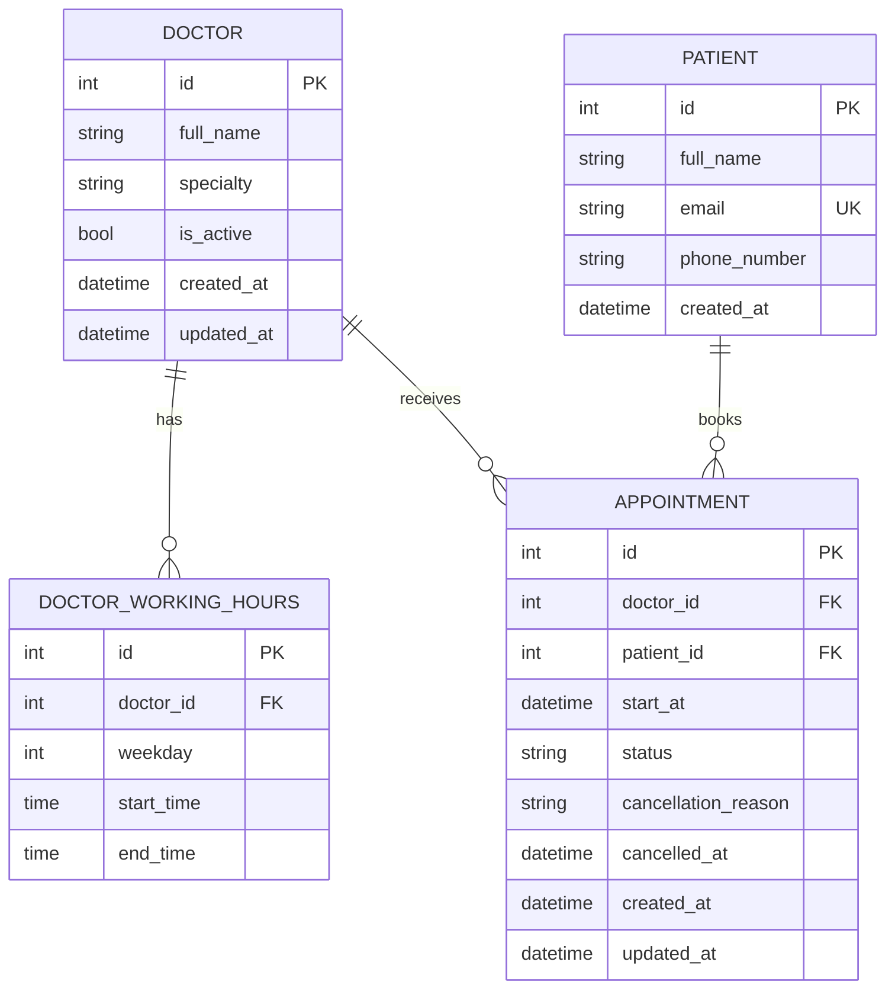

# Clinic Booking API

[](https://github.com/Gambi204/clinic-booking-api/actions/workflows/ci.yml)

A production-minded REST API for managing doctor availability and patient appointments in a small clinic. I built it for the Savannah Informatics Backend Developer Take-Home Assessment.

## Submission Links

- **Repository:** [github.com/Gambi204/clinic-booking-api](https://github.com/Gambi204/clinic-booking-api)
- **Live API:** [clinic-booking-api-emmanuel-riungu.onrender.com](https://clinic-booking-api-emmanuel-riungu.onrender.com)
- **Swagger UI:** [Interactive API documentation](https://clinic-booking-api-emmanuel-riungu.onrender.com/docs)
- **ReDoc:** [Alternative API documentation](https://clinic-booking-api-emmanuel-riungu.onrender.com/redoc)
- **Health check:** [Application and database health](https://clinic-booking-api-emmanuel-riungu.onrender.com/health)

> The public demonstration uses Render's free tier. The service may take about one minute to wake after being idle, and the free PostgreSQL database is time-limited. See [Deployment limitations](#deployment-limitations).

## Assessment Requirement Coverage

| Requirement | Implementation |
|---|---|
| Book an appointment | `POST /appointments` |
| View a doctor's availability | `GET /doctors/{doctor_id}/availability?date=YYYY-MM-DD` |
| Cancel with a reason and release the slot | `PATCH /appointments/{appointment_id}/cancel` |
| Reschedule and validate the new slot | `PATCH /appointments/{appointment_id}/reschedule` |
| Five doctors with 30-minute slots | Idempotent seed data and configurable working periods |
| Prevent double-booking | Application conflict checks plus a PostgreSQL partial unique index |
| Meaningful validation and HTTP errors | Structured `400`, `404`, `409`, and `422` responses |
| Sensible modular structure | Separate routes, schemas, services, models, configuration, and middleware |
| Booking-logic tests | PostgreSQL-backed service, API, constraint, and concurrency tests |
| Bonus: upcoming patient appointments | `GET /patients/{patient_id}/appointments` |
| Bonus: prevent booking within one hour | Configurable 60-minute minimum notice |
| Public cloud deployment | Render web service and PostgreSQL database |
| Tests on every pull request | GitHub Actions |
| Automatic deployment after merge | Render deploys `main` only after linked checks pass |
| AI reflection | [Detailed AI usage log and reflection](docs/AI_USAGE_LOG.md) |

## System Design

### Domain Models



#### Doctor

Stores the doctor's name, specialty, active status, working periods, and appointments.

#### Doctor working hours

Stores one or more working periods for a doctor on a weekday. Multiple periods allow schedules such as a morning shift and an afternoon shift separated by a lunch break.

#### Patient

Stores the patient identity used by the booking API. Email addresses are unique.

#### Appointment

Links one patient to one doctor at a timezone-aware start time. The end time is calculated from the fixed 30-minute duration. Appointments remain in the database after cancellation so their operational history is preserved.

### Main Components

| Component | Responsibility |
|---|---|
| FastAPI routes | Parse HTTP input, inject dependencies, map domain errors to HTTP responses, and return response models |
| Pydantic schemas | Validate request and response structures and reject unknown request properties |
| Service layer | Apply booking, availability, cancellation, rescheduling, and patient-query business rules |
| Scheduling service | Generate valid slots, normalize timezones, and enforce past-time and minimum-notice rules |
| SQLAlchemy models and sessions | Map domain data and provide explicit transaction boundaries |
| PostgreSQL | Persist data, enforce constraints, and provide row locking and concurrency-safe uniqueness |
| Alembic | Version and apply database schema changes |
| Middleware | Add request IDs and emit privacy-conscious JSON request logs |
| pytest | Exercise domain logic, API behavior, database constraints, and concurrent transactions |
| GitHub Actions and Render | Run CI and deploy passing changes from `main` |

### Request Flow

1. FastAPI validates the path, query parameters, and JSON body.
2. A request-scoped SQLAlchemy session is injected.
3. The route calls a framework-independent service function.
4. The service loads the required records and applies domain validation.
5. PostgreSQL commits the change or rejects a conflicting write.
6. The route returns a typed response or a structured error containing a request ID.

## Key Decisions and Trade-offs

| Decision | Reason | Trade-off |
|---|---|---|
| FastAPI | I had recent practical experience with it and could confidently explain and maintain the structure | It provides less built-in administration than Django |
| PostgreSQL | Strong transactions, row locks, check constraints, and partial unique indexes | Local and CI setup is heavier than SQLite |
| Synchronous SQLAlchemy | The transaction flow is straightforward to understand, test, and explain | It does not demonstrate asynchronous database access |
| Fixed duration stored implicitly | Every appointment lasts 30 minutes, so storing only `start_at` avoids redundant state | Supporting variable durations would require a schema change |
| Soft cancellation | Preserves history while releasing the slot through appointment status | Cancelled rows remain in the table |
| Partial unique index | Makes PostgreSQL the final safeguard against simultaneous double-booking | The implementation is PostgreSQL-specific |
| Africa/Nairobi normalization | Provides one consistent interpretation of doctor schedules and booking times | A multi-location clinic would need location-specific timezones |
| Incremental feature branches | Each capability could be reviewed, tested, and merged independently | The approach required more pull requests and took longer than one large commit |
| GitHub Actions | It integrates directly with the repository and clearly reports pull-request checks | CI depends on GitHub-hosted runners and a PostgreSQL service container |
| Render Blueprint | Infrastructure, health checks, environment variables, and deployment behavior are version-controlled | The deployment configuration is coupled to Render |

A more detailed record is available in [docs/DECISIONS.md](docs/DECISIONS.md).

## Requirement Interpretations

Where the assessment left room for interpretation, I made the following explicit decisions:

- Appointment timestamps must include a timezone offset. The API does not silently interpret naive timestamps.
- All clinic scheduling is normalized to `Africa/Nairobi`.
- Exactly 60 minutes' notice is accepted; a booking less than 60 minutes away is rejected.
- Slots are generated relative to the start of each working period, rather than assuming all shifts start on `:00` or `:30`.
- A non-working day is a valid availability request and returns an empty list.
- Only `scheduled` appointments block availability.
- A cancelled appointment cannot be rescheduled.
- Rescheduling to the existing time returns `409 Conflict`.
- Upcoming patient appointments exclude past and cancelled records.
- Appointment end times are calculated rather than stored.

## API Endpoints

| Method | Path | Purpose |
|---|---|---|
| `GET` | `/` | Service information |
| `GET` | `/health` | Application and PostgreSQL health |
| `POST` | `/appointments` | Create a scheduled appointment |
| `GET` | `/doctors/{doctor_id}/availability?date=YYYY-MM-DD` | List valid available slots |
| `PATCH` | `/appointments/{appointment_id}/cancel` | Cancel an appointment and release its slot |
| `PATCH` | `/appointments/{appointment_id}/reschedule` | Move an appointment atomically |
| `GET` | `/patients/{patient_id}/appointments` | List upcoming scheduled appointments |

Use Swagger for the complete generated schemas and interactive requests:

```text
https://clinic-booking-api-emmanuel-riungu.onrender.com/docs
```

### Create an Appointment

```http
POST /appointments
Content-Type: application/json
```

```json
{
  "doctor_id": 1,
  "patient_id": 1,
  "start_at": "2030-01-07T10:00:00+03:00"
}
```

Successful response: `201 Created`

```json
{
  "id": 1,
  "doctor_id": 1,
  "patient_id": 1,
  "start_at": "2030-01-07T10:00:00+03:00",
  "end_at": "2030-01-07T10:30:00+03:00",
  "status": "scheduled",
  "created_at": "2026-07-26T20:00:00+03:00"
}
```

### Get Doctor Availability

```http
GET /doctors/1/availability?date=2030-01-07
```

```json
{
  "doctor_id": 1,
  "doctor_name": "Dr. Amina Hassan",
  "date": "2030-01-07",
  "timezone": "Africa/Nairobi",
  "slot_duration_minutes": 30,
  "available_slots": [
    {
      "start_at": "2030-01-07T08:00:00+03:00",
      "end_at": "2030-01-07T08:30:00+03:00"
    }
  ]
}
```

### Cancel an Appointment

```http
PATCH /appointments/1/cancel
Content-Type: application/json
```

```json
{
  "reason": "Patient is no longer available."
}
```

Cancellation preserves the record, stores the reason and cancellation time, and immediately releases the original slot.

### Reschedule an Appointment

```http
PATCH /appointments/1/reschedule
Content-Type: application/json
```

```json
{
  "new_start_at": "2030-01-07T11:00:00+03:00"
}
```

The new slot is validated exactly like a fresh booking. A successful response includes `previous_start_at` and the new `start_at`. A failed validation or occupied destination leaves the original appointment unchanged.

### Get Upcoming Patient Appointments

```http
GET /patients/1/appointments
```

The endpoint returns only scheduled appointments at or after the current clinic time, ordered from earliest to latest. Each item includes the doctor's name and specialty.

## Validation and Error Responses

Handled errors use a consistent envelope:

```json
{
  "error": {
    "code": "SLOT_UNAVAILABLE",
    "message": "The requested appointment slot is no longer available.",
    "request_id": "frontend-request-12345"
  }
}
```

| Status | Use |
|---|---|
| `400 Bad Request` | A scheduling or business rule was violated |
| `404 Not Found` | A doctor, patient, or appointment does not exist |
| `409 Conflict` | The requested operation conflicts with current state |
| `422 Unprocessable Entity` | The request structure or field values are invalid |

Representative error codes include:

- `DOCTOR_NOT_FOUND`
- `PATIENT_NOT_FOUND`
- `APPOINTMENT_NOT_FOUND`
- `DOCTOR_INACTIVE`
- `TIMEZONE_REQUIRED`
- `APPOINTMENT_NOT_IN_FUTURE`
- `MINIMUM_NOTICE_NOT_MET`
- `DOCTOR_NOT_WORKING`
- `INVALID_APPOINTMENT_SLOT`
- `SLOT_UNAVAILABLE`
- `APPOINTMENT_ALREADY_CANCELLED`
- `CANCELLED_APPOINTMENT_CANNOT_BE_RESCHEDULED`
- `APPOINTMENT_TIME_UNCHANGED`
- `AVAILABILITY_DATE_IN_PAST`
- `REQUEST_VALIDATION_ERROR`

## Data Integrity and Concurrency

Double-booking protection has two layers:

1. The service checks whether a scheduled appointment already occupies the doctor and start time, allowing it to return a clear conflict response.
2. PostgreSQL enforces a partial unique index on `(doctor_id, start_at)` where status is `scheduled`.

The test suite includes a genuine two-transaction race. Both workers observe the slot as free before either transaction commits. PostgreSQL allows one booking to succeed and rejects the competing write, leaving exactly one scheduled appointment.

Cancellation and rescheduling also lock the selected appointment row so simultaneous mutations cannot act on stale state.

## Project Structure

```text
app/
├── api/            # Routes and API error handling
├── core/           # Settings, clock, and logging
├── db/             # SQLAlchemy base, engine, sessions, and dependencies
├── middleware/     # Request IDs and request logging
├── models/         # SQLAlchemy domain models
├── schemas/        # Pydantic request and response models
├── services/       # Business and scheduling logic
├── main.py         # FastAPI application
└── seed.py         # Idempotent demonstration data

alembic/            # Database migrations
tests/              # PostgreSQL-backed automated tests
docs/               # Design, AI reflection, and deployment evidence
.github/workflows/  # CI workflow
render.yaml         # Render Blueprint
```

## Local Setup

### Prerequisites

- Python 3.14.3
- PostgreSQL 18
- Git

### 1. Clone the repository

```bash
git clone https://github.com/Gambi204/clinic-booking-api.git
cd clinic-booking-api
```

### 2. Create and activate a virtual environment

Windows PowerShell:

```powershell
python -m venv .venv
.venv\Scripts\Activate.ps1
```

macOS/Linux:

```bash
python -m venv .venv
source .venv/bin/activate
```

### 3. Install dependencies

```bash
python -m pip install --upgrade pip
python -m pip install -r requirements.txt
```

### 4. Create development and test databases

Create two PostgreSQL databases, for example:

```text
clinic_booking_db
clinic_booking_test_db
```

Use a dedicated PostgreSQL role with access to both databases.

### 5. Configure environment variables

Copy the example file:

Windows PowerShell:

```powershell
Copy-Item .env.example .env
```

macOS/Linux:

```bash
cp .env.example .env
```

Configure `.env`:

```env
APP_NAME=Clinic Booking API
APP_VERSION=1.0.0
APP_ENV=development

DATABASE_URL=postgresql+psycopg://<user>:<password>@localhost:5432/clinic_booking_db
TEST_DATABASE_URL=postgresql+psycopg://<user>:<password>@localhost:5432/clinic_booking_test_db

CLINIC_TIMEZONE=Africa/Nairobi
SLOT_DURATION_MINUTES=30
MIN_BOOKING_NOTICE_MINUTES=60
```

The private `.env` file is ignored by Git and must not be committed.

### 6. Apply migrations

```bash
alembic upgrade head
alembic current
```

### 7. Seed demonstration data

```bash
python -m app.seed
```

The idempotent seed creates five doctors, their working periods, and three sample patients without duplicating existing seed records.

### 8. Start the API

```bash
python -m uvicorn app.main:app --reload
```

Open:

- `http://127.0.0.1:8000/docs`
- `http://127.0.0.1:8000/redoc`
- `http://127.0.0.1:8000/health`

## Testing

The suite runs against PostgreSQL rather than SQLite so PostgreSQL-specific constraints, partial indexes, row locks, and transaction behavior are tested directly.

Run all tests:

```bash
python -m pytest -v
```

Run with coverage:

```bash
python -m pytest --cov=app --cov-report=term-missing
```

Coverage includes:

- Root and database health.
- Database constraints and migration compatibility.
- Slot generation, shift alignment, breaks, and timezone conversion.
- Past-time and minimum-notice validation.
- Booking success and failure paths.
- Availability filtering.
- Cancellation, repeated cancellation, and slot release.
- Atomic rescheduling and rollback behavior.
- Upcoming patient appointment ordering and filtering.
- A simultaneous double-booking race.
- Request-ID generation and propagation.
- Structured domain and validation errors.
- JSON log formatting.
- Render database URL normalization.

## CI/CD

### Continuous Integration

GitHub Actions runs:

- On every pull request targeting `main`.
- On every push to `main`.

The workflow:

1. Starts a PostgreSQL 18 service container.
2. Sets up Python 3.14.3 and installs the pinned dependencies.
3. Applies and verifies the Alembic migration.
4. Runs the complete pytest suite with coverage.

### Continuous Deployment

The designated deployment branch is:

```text
main
```

Render is configured through `render.yaml` with `autoDeployTrigger: checksPass`. After a pull request is merged, GitHub Actions runs against the new `main` commit. Render deploys that commit only after the linked checks pass.

The Blueprint defines the web service, PostgreSQL database, environment variables, health check, build command, start command, and private database connection.

## Observability

Every response includes an `X-Request-ID` header. A valid client-provided identifier is preserved; otherwise, the API generates a UUID.

Application request logs are emitted as JSON and include:

- Request ID
- HTTP method
- Request path
- Status code
- Duration in milliseconds
- Client address

Request bodies, query-string values, patient details, email addresses, and phone numbers are intentionally excluded from application request logs.

## Deployment

Build command:

```bash
python -m pip install --upgrade pip &&
python -m pip install -r requirements.txt
```

Start command:

```bash
alembic upgrade head &&
python -m app.seed &&
python -m uvicorn app.main:app --host 0.0.0.0 --port $PORT
```

Migrations and the idempotent seed run before Uvicorn starts so a newly provisioned assessment environment is immediately testable.

### Deployment Limitations

The public demonstration uses Render free resources:

- The web service spins down after 15 minutes without inbound traffic and may take about one minute to wake.
- The free PostgreSQL database expires 30 days after creation.
- Free PostgreSQL does not include backups or managed connection pooling.
- The deployment is intended for assessment demonstration rather than long-term production use.

## AI Use and Reflection

I used AI as a development assistant for design review, implementation suggestions, test ideas, troubleshooting, deployment planning, and documentation structure. I did not accept AI output without reading, running, and testing it. I also recorded suggestions that were wrong or incomplete and explained how I corrected them.

The complete answers to the assessment's four AI-reflection questions are in [docs/AI_USAGE_LOG.md](docs/AI_USAGE_LOG.md).

## Supporting Documentation

- [Engineering decisions and trade-offs](docs/DECISIONS.md)
- [AI usage log and reflection](docs/AI_USAGE_LOG.md)
- [Deployment verification](docs/DEPLOYMENT_VERIFICATION.md)
- [Data model](docs/DATA_MODEL.md)
- [Project specification](docs/PROJECT_SPEC.md)
- [Render Blueprint](render.yaml)

## Limitations and Future Improvements

For a larger production system, I would next consider:

- Authentication and role-based authorization.
- Doctor and patient management endpoints.
- A permanent appointment-change audit trail.
- Database-level prevention of overlapping working-hour periods.
- Rate limiting and abuse protection.
- Pagination for patient appointment results.
- Production backups, connection pooling, and an always-on service tier.
- Metrics, alerting, and centralized log aggregation.

## Candidate

**Emmanuel Mugambi Riungu**
